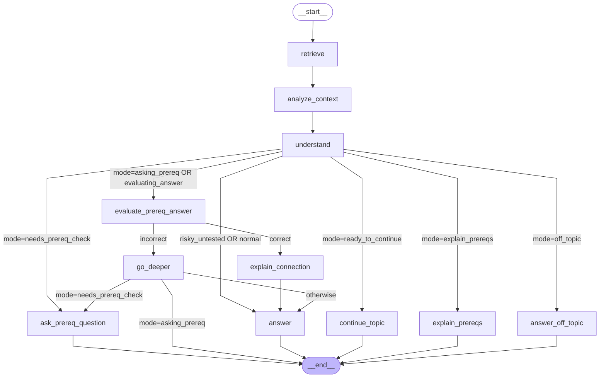

```mermaid
---
config:
  flowchart:
    curve: linear
---
graph TD
    __start__([__start__]):::first
    retrieve[retrieve]
    analyze_context[analyze_context]
    understand[understand]
    ask_prereq_question[ask_prereq_question]
    evaluate_prereq_answer[evaluate_prereq_answer]
    explain_connection[explain_connection]
    go_deeper[go_deeper]
    answer[answer]
    continue_topic[continue_topic]
    explain_prereqs[explain_prereqs]
    answer_off_topic[answer_off_topic]
    __end__([__end__]):::last

    __start__ --> retrieve
    retrieve --> analyze_context
    analyze_context --> understand

    %% Conditional edges from understand (route_after_understand)
    understand -->|"mode=needs_prereq_check"| ask_prereq_question
    understand -->|"mode=asking_prereq OR evaluating_answer"| evaluate_prereq_answer
    understand -->|"mode=ready_to_continue"| continue_topic
    understand -->|"mode=explain_prereqs"| explain_prereqs
    understand -->|"mode=off_topic"| answer_off_topic
    understand -->|"risky_untested OR normal"| answer

    %% ask_prereq_question ends (wait for user)
    ask_prereq_question --> __end__

    %% Conditional edges from evaluate_prereq_answer (route_after_evaluation)
    evaluate_prereq_answer -->|"correct"| explain_connection
    evaluate_prereq_answer -->|"incorrect"| go_deeper

    %% explain_connection goes to answer
    explain_connection --> answer

    %% Conditional edges from go_deeper (route_after_go_deeper)
    go_deeper -->|"mode=needs_prereq_check"| ask_prereq_question
    go_deeper -->|"mode=asking_prereq"| __end__
    go_deeper -->|"otherwise"| answer

    %% Terminal nodes
    answer --> __end__
    continue_topic --> __end__
    explain_prereqs --> __end__
    answer_off_topic --> __end__

    classDef first fill-opacity:0
    classDef last fill:#bfb6fc
```
